<p align="center">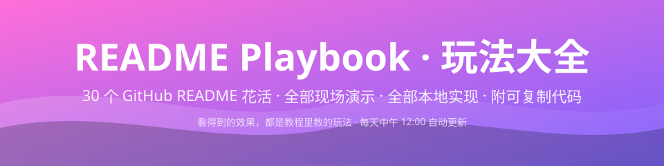</p>

<p align="center">
  
  
  
  
  
</p>

<a href="https://github.com/alsunmengy/readme-playbook/stargazers"></a>
<a href="https://github.com/alsunmengy"></a>

> [!IMPORTANT]
> **这是一份「活的」README 教程** —— 本页每一个卡片、动画、徽章都是教程里教的玩法，**整个页面就是全部 30 个玩法的现场演示**。
> 所有展示图均由本仓库脚本**本地生成**（`.github/scripts/`），不依赖任何外部在线服务，**每天中午 12:00 自动更新**。每个玩法的可复制代码拆分在 [`src/`](./src) 目录下独立成篇，抄就完事了喵！

## 📑 目录

| 分类 | 玩法 |
|---|---|
| 📊 数据统计 | [01 统计卡片](#01-统计卡片) · [02 连续贡献](#02-连续贡献天数) · [03 访客计数](#03-访客计数) · [04 WakaTime](#04-wakatime) · [05 动态徽章](#05-动态徽章) · [06 数据总览](#06-数据总览卡) · [30 一键 Star](#30-一键-star--star-历史) |
| 🎨 视觉娱乐 | [07 贪吃蛇](#07-贡献贪吃蛇) · [08 3D 贡献图](#08-3d-贡献城市) · [09 终端动画](#09-动态终端) · [10 图标带](#10-技术栈图标带) · [11 奖杯柜](#11-奖杯陈列柜) |
| 🕹️ 互动游戏 | [12 国际象棋](#12-交互式国际象棋) · [13 井字棋](#13-井字棋--四子棋) · [14 打砖块](#14-打砖块动画) |
| 🎧 生活社交 | [15 Spotify](#15-spotify-正在播放) · [16 博客同步](#16-博客自动同步) · [17 社交图标](#17-社交媒体图标) |
| ✨ 创意装饰 | [18 Bento](#18-bento-网格布局) · [19 动态横幅](#19-动态-svg-横幅) · [20 每日语录](#20-每日语录) · [27 图标墙](#27-技术栈图标墙) · [28 隐藏注释](#28-隐藏注释) · [29 提示框](#29-高亮提示框) |
| 🐾 养成模拟 | [21 宠物卡](#21-宠物进度卡) · [22 平台卡片](#22-平台模拟卡片) |
| 🤖 AI 自动化 | [23 AI 徽章](#23-ai-参与徽章) · [24 内容同步](#24-内容自动同步) |
| 📈 进阶可视 | [25 综合信息图](#25-综合信息图) · [26 Star 历史](#26-star-历史曲线) |

---

## 📊 数据统计类

### 01 统计卡片

<table>
<tr>
<td width="62%">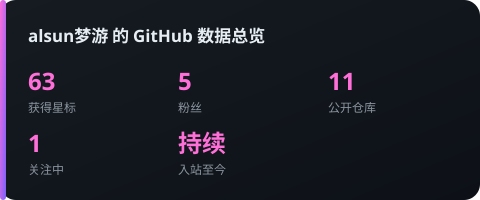</td>
<td width="38%">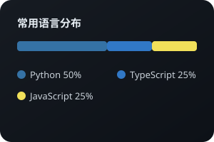</td>
</tr>
</table>

<details><summary>💡 外部服务一行流（教程内容）</summary>

```markdown

```

本页演示用的是**本地自绘版**（`gen_stats.py`），零依赖永不裂图。两种实现都在 [`src/01-github-stats/`](./src/01-github-stats/)。

</details>

### 02 连续贡献天数

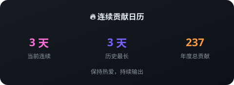

<details><summary>💡 实现说明</summary>

数据来自 GitHub GraphQL 贡献日历，自绘 SVG。外部服务版：`https://streak-stats.demolab.com?user=你的ID`。详见 [`src/02-streak-stats/`](./src/02-streak-stats/)。

</details>

### 03 访客计数


数据源是 **GitHub 自家 traffic API**，每天中午 12 点累计入库（`views-data.json`），比第三方计数服务可靠得多喵～

### 04 WakaTime

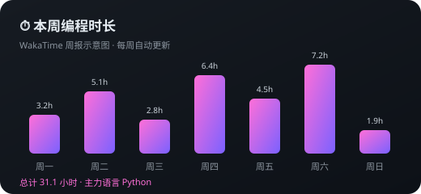

> [!TIP]
> 记录编码时长出周报图表，需要绑定 WakaTime 账号 + 编辑器插件。属于「外部账号绑定」类玩法，配置步骤见 [`src/04-wakatime/`](./src/04-wakatime/)。

### 05 动态徽章

<p>   </p>

本页的徽章是**手绘 SVG**（5 行代码画一个），不挂 shields.io —— 教程里同时教外部服务版，见 [`src/05-dynamic-badges/`](./src/05-dynamic-badges/)。

### 06 数据总览卡

玩法 01 的统计卡就是「个人简介摘要卡」的本地实现。外部服务版（profile-summary-cards）见 [`src/06-profile-summary/`](./src/06-profile-summary/)。

---

## 🎨 视觉娱乐类

### 07 贡献贪吃蛇


**纯本地 SMIL 动画** —— 小蛇沿着贡献图蛇形前进，吃过的格子依次点亮，无限循环。不依赖任何第三方 action，`gen_snake.py` 一个脚本搞定，详见 [`src/07-snake/`](./src/07-snake/)。

### 08 3D 贡献城市

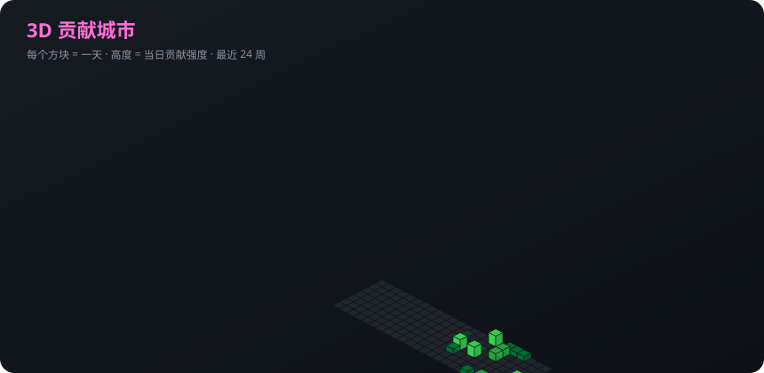

等距视角 3D 柱状图，每个方块是一天，高度代表贡献强度。原版公共服务已下线（404），本地图永不掉线喵！

### 09 动态终端


SVG SMIL 打字机动画：命令逐条「敲」出来、光标闪烁，GitHub 原生渲染，零依赖。

### 10 技术栈图标带

<p></p>
<p></p>

图标已下载入库（`assets/icons/`），断网都能显示～

### 11 奖杯陈列柜

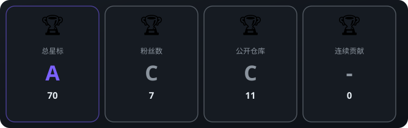

S 级以上带金色光效！公共实例欠费（402）不存在的，自己画的永远能用（`gen_trophy.py`），玩法说明见 [`src/11-trophy/`](./src/11-trophy/)。

---

## 🕹️ 互动游戏类

### 12 交互式国际象棋

<a href="https://github.com/alsunmengy/readme-playbook/issues/2">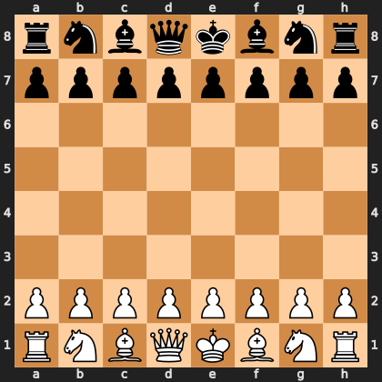</a>

> [!IMPORTANT]
> **这局棋现在就能下！** 去 [♟️ 国际象棋对战帖](https://github.com/alsunmengy/readme-playbook/issues/2) 评论 `!move e2e4`，Actions 自动校验走法并更新上面的棋盘（README 里的图会跟着刷新）。
> 实现原理：Issue 评论 → `game-move.yml` 触发 → python-chess 裁决 → 重绘 SVG 提交。完整方案见 [`src/12-chess/`](./src/12-chess/)。

### 13 井字棋 / 四子棋

<a href="https://github.com/alsunmengy/readme-playbook/issues/1">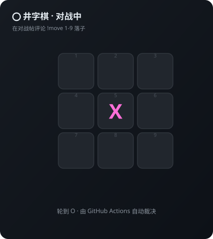</a>

> [!IMPORTANT]
> **这盘棋现在就能下！** 去 [⭕ 井字棋对战帖](https://github.com/alsunmengy/readme-playbook/issues/1) 评论 `!move 5`（1-9 对应格子），Actions 自动落子裁决，README 棋盘实时刷新。
> 四子棋同理，状态机代码见 [`src/13-tictactoe-connect4/`](./src/13-tictactoe-connect4/)。

### 14 打砖块动画

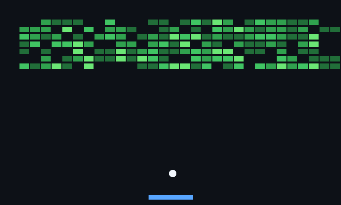

贡献图当砖块，球弹来弹去消格子！上面就是 `breakout.py` 实跑生成的 150 帧 GIF，脚本在 [`src/14-breakout/`](./src/14-breakout/)，可直接改参数换玩法。

---

## 🎧 生活与社交类

### 15 Spotify 正在播放


> [!TIP]
> 需要 Spotify 账号授权 + 自建小服务（Vercel/Cloudflare 均可），带均衡器动效。配置步骤见 [`src/15-spotify-now-playing/`](./src/15-spotify-now-playing/)。

### 16 博客自动同步

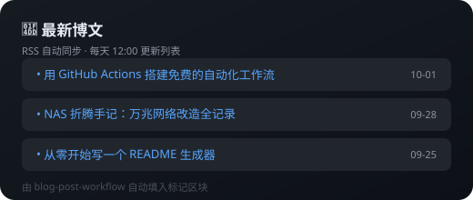

```markdown
<!-- BLOG-POST-LIST:START -->
<!-- 这里会被 GitHub Actions 自动填充最新博文 -->
<!-- BLOG-POST-LIST:END -->
```

本仓库的 [`blog-post.yml`](./.github/workflows/blog-post.yml) 已配好，填上真实 RSS 地址即自动生效，每天 12 点同步。

### 17 社交媒体图标

<p></p>

---

## ✨ 创意与装饰类

### 18 Bento 网格布局

本页 [01 统计卡片](#01-统计卡片) 处的双卡并排就是 Bento 思路的最小实现 —— HTML `<table>` 的 `rowspan`/`colspan` 拼不对称网格。大杂烩示例见 [`src/18-bento-grid/`](./src/18-bento-grid/)。

### 19 动态 SVG 横幅

本页顶部的渐变波浪横幅就是本地 SVG！亮暗主题自动切换的 `<picture>` 写法见 [`src/19-dynamic-banner/`](./src/19-dynamic-banner/)。

### 20 每日语录

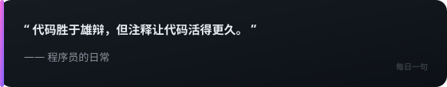

本地语录库按日期轮换，每天中午 12 点随自动更新换新句，永动机喵～

### 27 技术栈图标墙

200+ 图标可选的图标墙就是 [10 图标带](#10-技术栈图标带) 的完全体，图标 ID 清单在 [`src/27-tech-stack-wall/`](./src/27-tech-stack-wall/)。

### 28 隐藏注释

<!--
  🐱 这段字只有点「编辑」才能看到！
  TODO: 给 3D 贡献城市加个昼夜光照
  爱弥斯说：记得按时吃饭再写代码哦
  提醒: 公开仓库的编辑页谁都能看，千万别写真密码
-->

**就是现在** —— 这段字在页面上完全隐身，但你点「编辑」就能看到留的小纸条。

### 29 高亮提示框

> [!NOTE]
> **补充信息**：五色提示框是 GitHub 原生语法，零依赖。

> [!TIP]
> **小技巧**：`> [!TIP]` 这样写就行。

> [!IMPORTANT]
> **关键信息**：重点内容用它标记。

> [!WARNING]
> **注意事项**：可能出问题的地方。

> [!CAUTION]
> **危险操作**：不可逆操作前的最后警告。

---

## 🐾 养成与模拟类

### 21 宠物进度卡

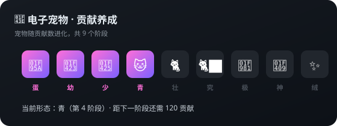

> [!NOTE]
> 电子宠物吃你的贡献长大，共 9 个进化阶段，最高形态是「雪绒」。渲染脚本见 [`src/21-pet-card/`](./src/21-pet-card/)。

### 22 平台模拟卡片

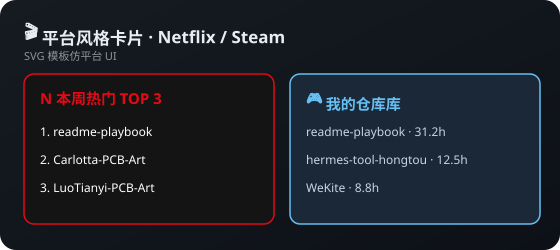

Netflix「今日 TOP 10」、Steam 游戏卡、Duolingo 连胜……SVG 模板仿平台 UI，模板在 [`src/22-platform-cards/`](./src/22-platform-cards/)。

---

## 🤖 AI 与自动化类

### 23 AI 参与徽章

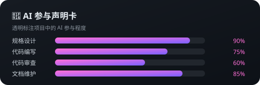

透明声明 AI 参与程度，或分析 git 历史算出「Vibe Coding 占比」，玩法见 [`src/23-ai-badge/`](./src/23-ai-badge/)。

### 24 内容自动同步

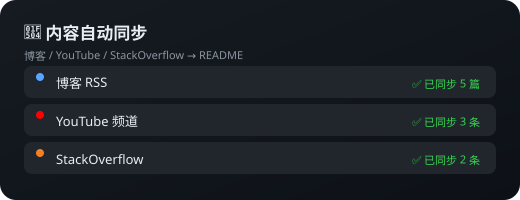

博客 / YouTube / StackOverflow 的 RSS 通过 Actions 定时同步进 README，零手动维护，通用配置见 [`src/24-rss-auto-sync/`](./src/24-rss-auto-sync/)。

---

## 📈 进阶可视化

### 25 综合信息图

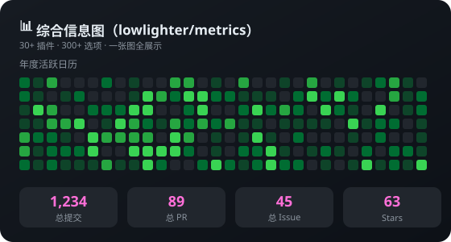

> [!TIP]
> `lowlighter/metrics` 一张图塞下 30+ 插件（Spotify、WakaTime、日历热力图…），需要配置一个 PAT 密钥后启用，完整 workflow 在 [`src/25-metrics-infographic/`](./src/25-metrics-infographic/)。

### 26 Star 历史曲线

**真实效果示例**（多仓库同屏 + 合成数据演示）：

<table>
<tr>
<td width="50%">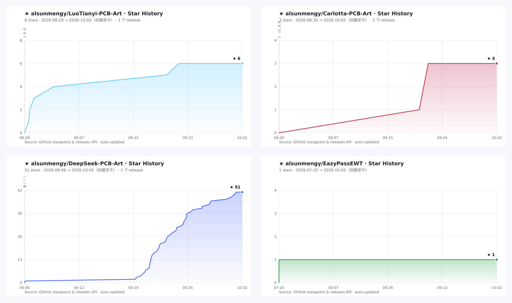</td>
<td width="50%">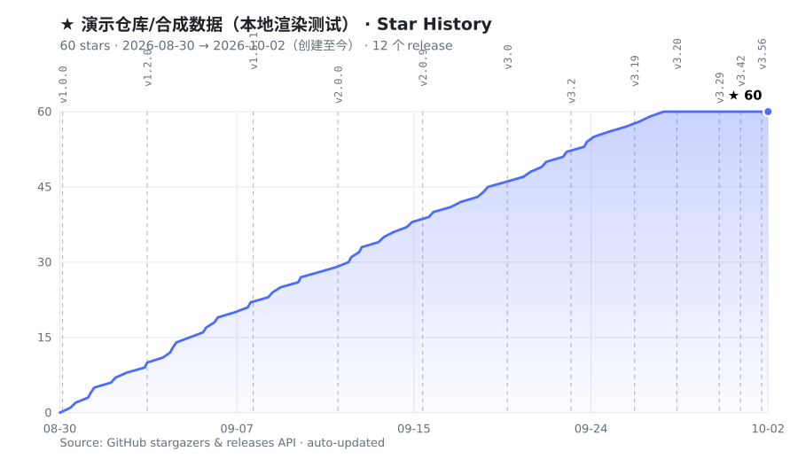</td>
</tr>
</table>

**本仓库的实时曲线**（每天 12:00 自动补点）：

<a href="https://github.com/alsunmengy/readme-playbook/stargazers">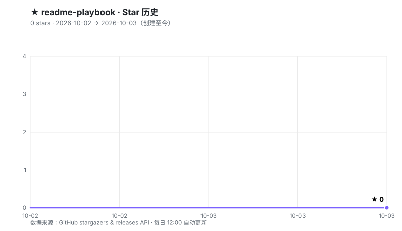</a>

自绘曲线图（`gen_chart.py`）：从建仓第一天画到今天，带 release 垂直线标注，每天中午 12 点自动补点。

---

## 30 一键 Star & Star 历史

<p align="center">
  <a href="https://github.com/alsunmengy/readme-playbook/stargazers"></a>
  <a href="https://github.com/alsunmengy"></a>
</p>

<p align="center"></p>

> [!CAUTION]
> **零依赖说明**：本页所有展示图都由 [`.github/scripts/`](./.github/scripts/) 的 10 个 Python 脚本本地生成，每天中午 12:00 由 [daily-update.yml](./.github/workflows/daily-update.yml) 统一刷新，不依赖任何第三方在线图片服务。
> [`src/`](./src) 目录里同时保留了各玩法的**外部服务一行流**实现（作为教程内容），你可以按喜好二选一。
